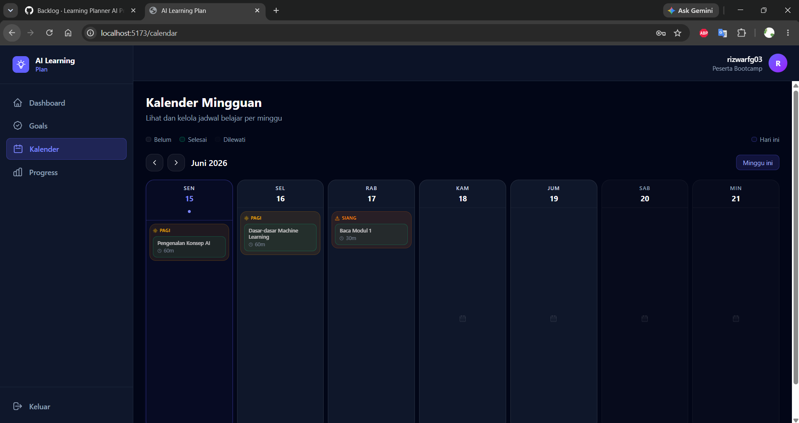
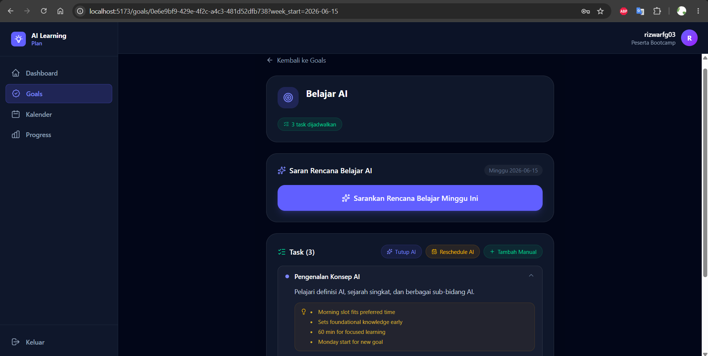

# Learning Planner AI — One-Page Case Study

## Overview

Learning Planner AI adalah aplikasi web yang dirancang untuk membantu peserta bootcamp merencanakan dan menjalani proses belajar secara lebih konsisten dengan bantuan AI sebagai learning coach.

---

## Problem

Peserta bootcamp sering mengalami kesulitan dalam:

* Menentukan prioritas belajar.
* Menjaga konsistensi dalam menjalankan jadwal belajar.
* Menyesuaikan kembali jadwal ketika terdapat tugas yang tertunda.
* Memantau perkembangan belajar secara objektif.

Proses perencanaan yang dilakukan secara manual sering kali memakan waktu dan kurang fleksibel terhadap perubahan.

---

## Solution

Learning Planner AI menyediakan fitur utama:

### Weekly Calendar

Membantu pengguna melihat seluruh jadwal belajar dalam satu tampilan mingguan.

**Screenshot:** Kalender mingguan aplikasi.

---

### AI Learning Coach

AI menghasilkan rekomendasi tugas belajar berdasarkan goal yang dimiliki pengguna.

Alur:

Goal → AI Suggestion → User Accept → Task ditambahkan ke kalender.

**Screenshot:** Halaman AI suggestion.

---

### AI Rescheduling

Tugas yang overdue dapat dijadwalkan ulang dengan mempertimbangkan jadwal yang sudah ada dan kapasitas belajar pengguna.

**Screenshot:** Proses AI reschedule.

---

### Progress Tracking

Pengguna dapat memantau progres belajar mingguan melalui indikator penyelesaian task dan perkembangan goal.

**Screenshot:** Dashboard progress.

---

## Technical Highlights

* Frontend: React + Vite + Tailwind CSS
* Backend: Node.js + Express.js
* Database: PostgreSQL
* Infrastructure: Docker + Redis
* AI Integration: Gemini API
* Output Validation: Zod Schema Validation

---

## Impact

* Membantu pengguna membuat rencana belajar yang lebih terstruktur.
* Mengurangi usaha manual dalam penyusunan jadwal belajar.
* Mendukung konsistensi belajar melalui monitoring progress.
* Menunjukkan implementasi integrasi AI dalam aplikasi full-stack modern.

# Learning Planner AI — One-Page Case Study

## Weekly Calendar

## AI Suggestion Flow

## Progress Dashboard

